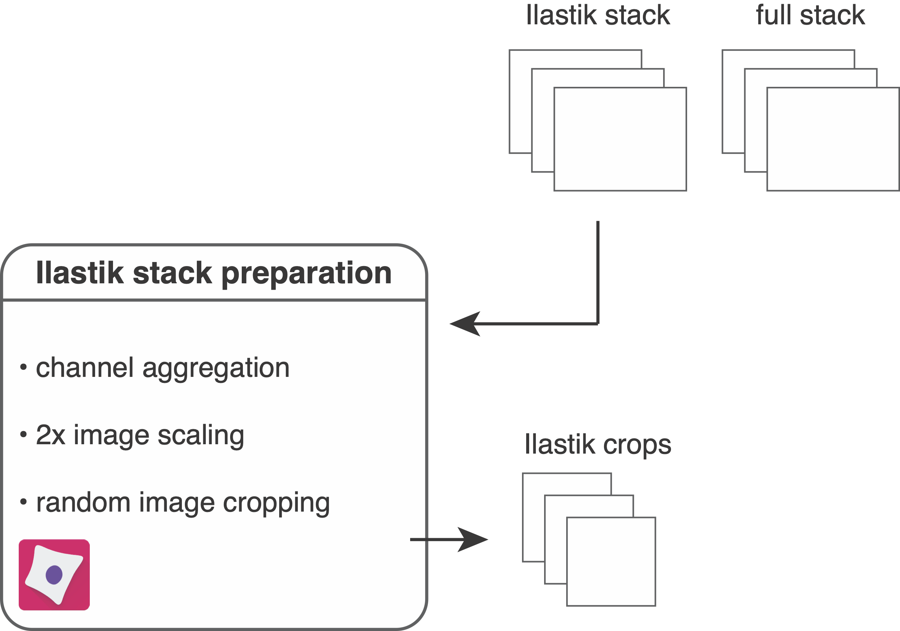
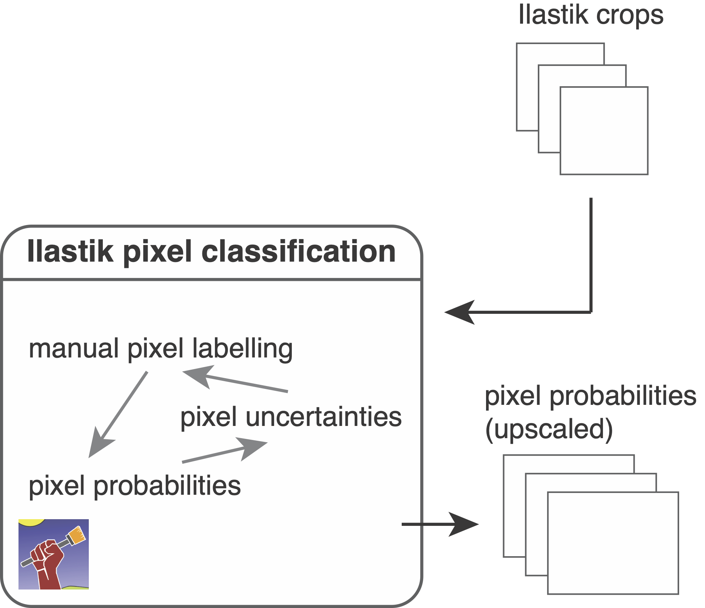

# Ilastik pixel classification

In this setp, we use [Ilastik](https://www.ilastik.org/) to label pixels and train a random-forest classifier for semantic segmentation. 
This means that each pixel will be classified as "nuclear", "cytoplasmic" or "background".
The probability of each pixel belonging to one of these classes will be used for image segmentation (see [cell segmentation](segmentation.md)).

## Prepare images for pixel classification

<figure markdown>
  { width="500" }
</figure>

In the first step, the `resources/pipelines/1_prepare_ilastik.cppipe` [CellProfiler](https://cellprofiler.org/) pipeline will be used to prepare images for labelling and classification.
To get started, you will need to open CellProfiler and import the `1_prepare_ilastik.cppipe` pipeline.

1. Drop the `analysis/ilastik` folder into the window under `Images`  
2. In `Output Settings` set the `analysis/crops` folder as `Default Output Folder`  

The pipeline will read in all multi-channel images from the `analysis/ilastik` folder containing the suffix `_ilastik`. 
The following steps are part of the pipeline:

1. The average intensity across all channels is computed and multiplied by 100. This will later serve as visual help to find background areas during Ilastik pixel labelling.  
2. The average is clipped to 0 and 1 (after uint16 rescaling) to avoid out-of-range errors.  
3. The average channel is added to the Ilastik stack as first channel.  
4. The pixels of the Ilastik stack are upscaled by a factor of 2. This will increase the number of pixels in the image 4 fold and facilitates pixel labelling.  
5. The Ilastik stack is cropped into smaller fields of view. By default these are 500x500 pixel crops but for large datasets smaller image crops will suffice.  
6. The upscaled Ilastik stack is saved in `.h5` format into the `analysis/ilastik` folder and the cropped images are saved into the `analysis/crops` folder.  

## Train and apply a pixel classifier

<figure markdown>
  { width="500" }
</figure>

Here, we will open [Ilastik](https://www.ilastik.org/) and perform pixel labelling as well as pixel classification.
For a detailed overview on Ilastik pixel classification refer to the [manual](https://www.ilastik.org/documentation/pixelclassification/pixelclassification).
After using the `scripts/download_examples.ipynb` script, you can find the `IMCWorkflwo.ilp` Ilastik project in the root directory of the repository.
This project contains a classifier pre-trained on the example IMC data.

To create a new classifier, please follow the steps below:

1. Create a new  `Pixel Classification` project.
2. Under `Input Data` press `Add New...` > `Add separate Image(s)` and select all `.h5` files in the `analysis/crops` folder.  
3. `Feature Selection`: we generally recommend to select all features with &sigma; >= 1  
4. `Training`: The following steps need to be performed to train the classifier
    * Create and rename 3 labels: Label 1 - "nucleus"; Label 2 - "cytoplasm"; Label 3 - "background"
    * Observe the different channels: the last entry `Raw Input` in the box on the bottom left indicates the current channel. You can change the channel by using the buttons on the left and the channel order is stored in the `_ilastik.csv` files in the `analysis/ilastik` folder.
    * Adjust the contrast of the channel: This can be done by selecting the `Window Leveling` tool under `Add Label`. Holding the left mouse button and moving the mouse changes the visual appearance of the channel. Clicking the right mouse button resets the channel intensities.
    * Label the pixels: Select the `Brush Cursor` tool and draw lines on the image. You can get an orientation by looking at the labels in the `IMCWorkflow.ilp` project. Switch between labels to label pixels as "nucleus", "cytoplasm" and "background". Label pixel in an opiniated fashion: If you see in the nucleus channel that two nuclei are stuck together but have a faint dip in intensity in between, label this dip as "cytoplasm". Encircle nuclei with "cytoplasm".  
    * After labelling a few images, click on `Live Update`. This will show the current prediction for the three classes. Labelling while keeping `Live Update` enabled slows down the process.
    * Observe the uncertainties by clicking the "eye" next to `Uncertainty`. This will show you regions in which classification uncertainty is highest. These regions need to be re-labelled. A well trained classifier has low uncertainty within class regions (e.g., nuclei) and high uncertainty at class borders (e.g., between nuclei and cytoplasm).
5. `Prediction Export`: Once the classifier is well trained, perform the following steps to export predictions:
    * `Source`: `Probabilities`
    * `Choose Export Image Settings`: 
        - `Convert to Data Type`: unsigned 16-bit
        - check `Renormalize`
        - `Format`: tiff
6. `Batch Processing`: In this step the pixel probabilities of all images will be generated.
    * `Select Raw Data Files...`: Select all `_s2.h5` files in the `analysis/ilastik` folder.
    * Click on `Process all files`

The last step will generate 3 channel RGB images containing the pixel probabilities for image segmentation (see [cell segmentation](segmentation.md)).
        
## Output

The following outputs have been generated during this step of the pipeline:

* `analysis/crops`: this folder contains the image crops of the ilastik stack in `.h5` format for ilastik training.
* `analysis/ilastik/..._s2.h5`: upscaled ilastik stack in `.h5` format for pixel classification.  
* `analysis/ilastik/..._s2_Probabilities.tiff`: 3 channel RGB images containg the pixel probabilities for segmentation.