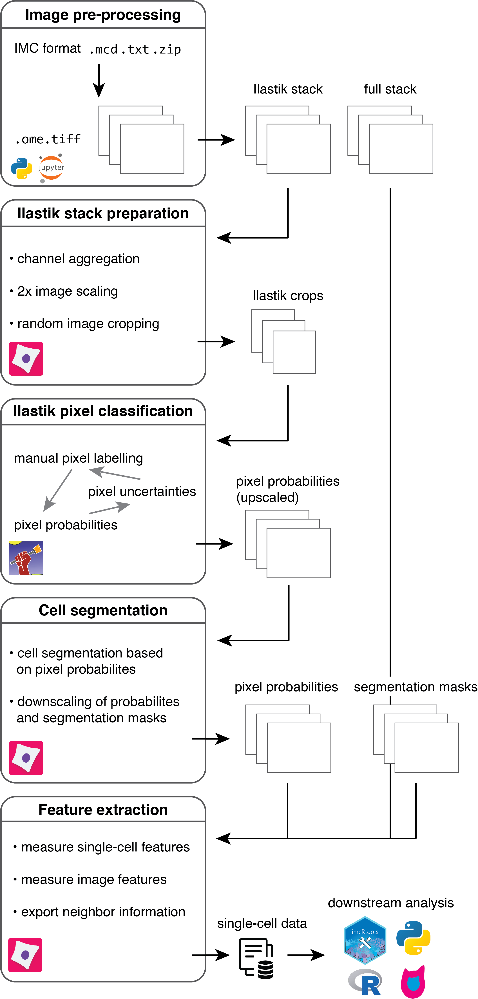

# A flexible multiplexed image segmentation pipeline based on pixel classification

Measuring objects and their features in images is a basic step in many quantitative tissue image analysis workflows. 
This repository presents a flexible and scalable image processing pipeline tailored to highly multiplexed images facilitating the segmentation of single cells across hundreds of images. 
It is based on supervised pixel classification using [Ilastik](https://www.ilastik.org/) to distill segmentation relevant information from multiplexed images in a semi-supervised, automated fashion. 
This feature reduction step is followed by standard image segmentation using [CellProfiler](https://cellprofiler.org/).
The segmentation pipeline is accompanied by the `imcsegpipe` python package building up on [readimc](https://github.com/BodenmillerGroup/readimc) as well as customized [CellProfiler modules](https://github.com/BodenmillerGroup/ImcPluginsCP), which facilitate the analysis of highly multiplexed images. 
The pipeline is entirely build on open source tools, can be easily adapted to more specific problems and forms a basis for quantitative multiplexed tissue image analysis.
For a more detailed introduction to IMC as technolgy and common data analysis steps, please refer to the [IMC workflow website](https://bodenmillergroup.github.io/IMCWorkflow/).

The [steinbock](https://github.com/BodenmillerGroup/steinbock) framework offers a dockerized version of the pipeline and extends the segmentation approach by [deepcell](https://github.com/vanvalenlab/intro-to-deepcell) segmentation. 

This site gives detailed explanations of the individual steps of the pipeline ([see below](#overview)) to generate single-cell measurements from raw imaging data. 

## Scope

While we highlight the use of the pipeline with imaging mass cytometry (IMC) data, the concepts presented here can be easily applied to other highly multiplexed imaging data.
Starting with `.ome.tiff` or `.tiff` files, Ilastik pixel classification, segmentation and feature extraction can be performed in a technology-agnostic way.

## Critical notes

There are some points that need to be considered when using this pipeline:

1. The input files need to be `.zip` folders that contain the `.mcd` files and `.txt` files (see the [pre-processing section](prepro.md))
2. It is recommended to acquire 5 or more channels to avoid potential downstream problems where images are considered to be of the RGBA type (red, green, blue, alpha).

## Documentation

The guide displayed here gives detailed information on how to  handle IMC images.
For additional information on `CellProfiler`, please refer to their [manuals](https://cellprofiler.org/manuals).

## Getting started

For the main part of the analysis, you will need to install [Ilastik](https://www.ilastik.org/download.html) and [CellProfiler](https://cellprofiler.org/releases).
The current setup is tested with Ilastik v1.3.3post3 and CellProfiler v4.2.1.

Furthermore, before running the analysis, you will need to setup a `conda` environment:

1. [Install conda](https://docs.conda.io/projects/conda/en/latest/user-guide/install/)

2. Clone the repository: 

    ```
    git clone --recursive https://github.com/BodenmillerGroup/ImcSegmentationPipeline.git
    ```

3. Setup the conda environment: 

    ```
    cd ImcSegmentationPipeline
    ```
    
    ```
    conda env create -f environment.yml
    ```

4. Configure CellProfiler to use the plugins by opening the CellProfiler GUI, selecting `Preferences` and setting the `CellProfiler plugins directory` to `path/to/ImcSegmentationPipeline/resources/ImcPluginsCP/plugins` and **restart CellProfiler**. Alternatively you can clone the `ImcPluginsCP` repository individually and set the path correctly in CellProfiler.

5. Activate the environment created in 3. and start a jupyter instance

    ```
    conda activate imcsegpipe
    ```
    
    ```
    jupyter-lab
    ```

This will automatically open a jupyter instance at `http://localhost:8888/lab` in your browser.
From there, you can open the `scripts/imc_preprocessing.ipynb` notebook and start the data pre-processing.

## Image data types

Throughout this pipeline, images in TIFF format are saved as unsigned 16-bit images with an intensity range of `0 - 65535`. For an overview on common image data types, please refer to the [scikit-image documentation](https://scikit-image.org/docs/dev/user_guide/data_types.html). 

## Pre-processing

To work with the generated imaging data, they will first be converted into OME-TIFF, multi-channel and single-channel TIFF formats that are compatible with most imaging software.
A key step of the pre-processing pipeline is also the selection of channels for (i) downstream cell measurements and (ii) ilastik pixel classification. 
A `CellProfiler` pipeline is used to crop smaller images for reducing the computational burden during pixel labelling.

Please follow the [pre-processing guide](prepro.md) for more information. 

## Ilastik training

Image crops are labelled based on nuclear, cytoplasmic and background pixels. 
The classification probability is observed and regions with high uncertainty are re-labelled.
Based on the specified labels, probabilities for each pixel belonging to the nuclear, cytoplasmic and background class are generated. 
These pixel-level propabilies are used to segment images in the next step.

Please follow the [Ilastik instructions](ilastik.md) for more information.

## CellProfiler image segmentation

A `CellProfiler` pipeline is used to segment cells based on the pixel probabilities generated in the previous step. 
Segmentation masks are written out as single-channel TIFF images that match the input images in size, with non-zero grayscale values indicating the IDs of segmented objects (e.g. cells).

A second `CellProfiler` pipeline is then used to extract object-specific features (e.g. mean intensity per channel and object) and to write out these features as CSV file.

Please follow the [segmentation instructions](segmentation.md) for more information.

<figure markdown>
  { width="500" }
  <figcaption><a name="overview">An overview of the full segmentation pipeline</a></figcaption>
</figure>

## Downstream analysis

For downstream analysis in `R`, please refer to the [IMC Data Analysis](https://bodenmillergroup.github.io/IMCDataAnalysis/) workflow and the [read_cpout](https://bodenmillergroup.github.io/imcRtools/reference/read_cpout.html) function of the [imcRtools](https://github.com/BodenmillerGroup/imcRtools) package.

## Contributors

**Creator:** Vito Zanotelli [:fontawesome-brands-github:](https://github.com/votti) [:fontawesome-brands-twitter:](https://twitter.com/ZanotelliVRT)    
**Contributors:** Jonas Windhager [:fontawesome-brands-github:](https://github.com/jwindhager) [:fontawesome-brands-twitter:](https://twitter.com/JonasWindhager), Nils Eling [:fontawesome-brands-github:](https://github.com/nilseling) [:fontawesome-brands-twitter:](https://twitter.com/NilsEling)  
**Maintainer:** Nils Eling

## Citation

```
@misc{ImcSegmentationPipeline,
    author       = {Vito RT Zanotelli, Bernd Bodenmiller},
    title        = {{ImcSegmentationPipeline: A pixel-classification based multiplexed image segmentation pipeline}},
    year         = 2022,
    doi          = {10.5281/zenodo.3841961},
    version      = {3.0},
    publisher    = {Zenodo},
    url          = {https://doi.org/10.5281/zenodo.3841961}
    }
```
