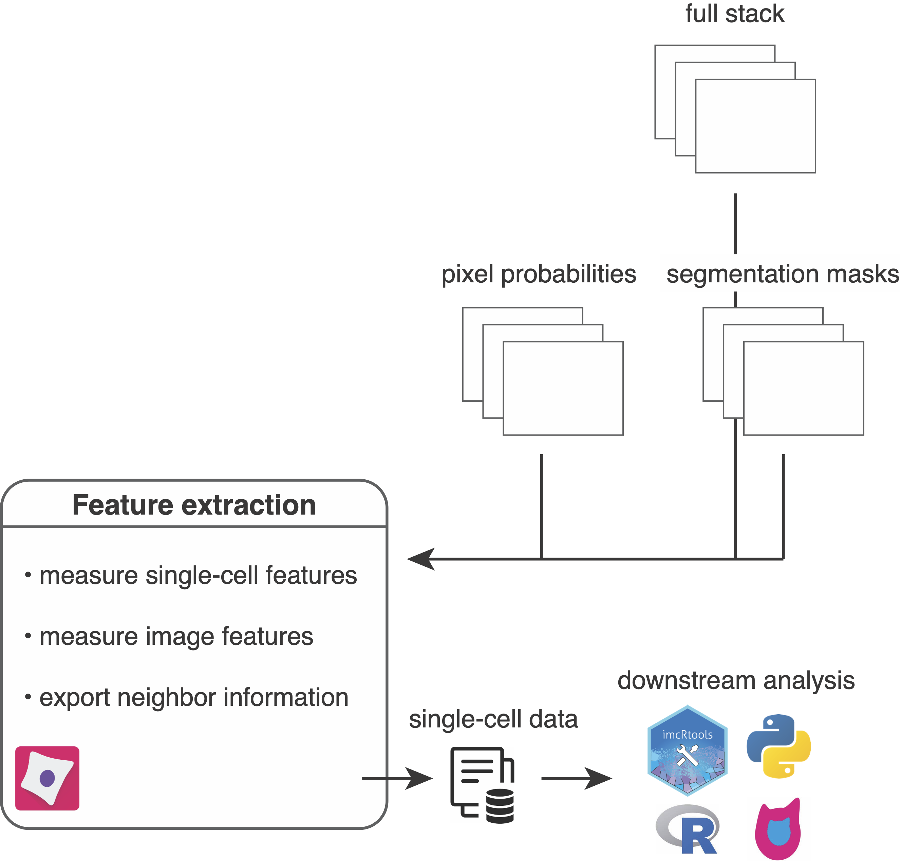

# Measurement of object features

<figure markdown>
  { width="500" }
</figure>

After image segmentation to identify individual objects/cells, the next CellProfiler pipeline will measure single-object and single-image features.
Set up the pipeline by importing the `resources/pipelines/3_measure_mask.cppipe` pipeline into CellProfiler and perform following steps:

1. Drag and drop the `analysis/cpout` folder into the `Images` window.
2. In the `Output Settings` adjust the `Default Output Folder` to `analysis/cpout`.
2. In the `Output Settings` adjust the `Default Input Folder` to `analysis/cpinp`.

The following steps are part of the pipeline:

1. `Metadata`: Metadata from the images (`acname` and `acid`) are matched and merged with image metadata generated during [pre-processing](prepro.md) (contained in the `analysis/cpinp/acquisition_metadata.csv` file).
2. `NamesAndTypes`: The multi-channel images (stored in `analysis/cpout/images`), segmentation masks (stored in `analysis/cpout/images`) and the pixel probabilities (stored in `analysis/cpout/probabilities`) are read in and matched via their acquisition name (`acname`) and acquisition ID (`acid`).
3. Segmentation masks are read in as 16-bit grayscale images and are converted to objects while keeping their original labels in place.
4. For each cell its neighbors are detected by expanding the mask by a defined distance.
5. The full stack channel intensities per object/cell are extracted. Make sure to adjust the channel number to your dataset. You can observe the total channel number in the `analysis/cpout/images/..._full.csv` files.
6. The probability stack channel intensities per object/cell are extracted. 
7. The size and shape features per object/cell are extracted.
8. The full stack channel intensities per image are extracted. Make sure to adjust the channel number to your dataset. You can observe the total channel number in the `analysis/cpout/images/..._full.csv` files.
9. The probability stack channel intensities per image are extracted. 
10. The object/cell, image and experiment data is saved as `.csv` files. The `cell.csv` file contains single-cell features including intensity and morphological features. Here are a few notes to the  export: 
    - You can select a subset of features by setting `Select the measurements to export` to `Yes`. We usually work with the `MeanIntensity` cell measurements.
    - the intensity values are all scaled by a scaling factor corresponding to the bit depth. This scaling factor can be found in the `Image.csv` file in the `Scaling_FullStack` column. For 16-bit unsigned integer images (`uint16`) as we use them here the values are divided by `2**16 - 1 = 65535`.
    - The channel identifier `_c1`, `_c2`, `_c3`, ... corresponds to the position in the `..._full.csv` files found in the `analysis/cpout/images` folder.
    - The original acquisition description, acquisition frequencies, acquisition name, etc. can be found in the `Image.csv` output file as `Metdata_...` columns.
11. The cell-cell neighbor information detected in step 4 are exported as `.csv` file containing an edge list.
12. The final output are `.csv` files that contain additional metadata per measured feature. For the cell features the following information is written out: `category` (e.g. Intensity), `image_name` (e.g. FullStack), `object_name`, `feature_name` (e.g. MeanIntensity), `channel` (e.g. 1), `parameters`, `channel_id` (e.g. Ir191) and `data_type` (e.g. float)

## Output

After feature measurment the following files have been generated:

* `analysis/cpout/cell.csv`: contains features (columns) for each cell (rows).
* `analysis/cpout/Experiment.csv`: contains metadata related to the CellProfiler version used.
* `analysis/cpout/Image.csv`: contains image-level measurements (e.g. channel intensities) and acquisition metadata. 
* `analysis/cpout/Object relationships.csv`: contains neighbor information in form of an edge list between cells.
* `analysis/cpout/var_cell.csv`: contains feature metadata for all single-cell features.
* `analysis/cpout/var_Image.csv`: contains feature metadata for all image features.

