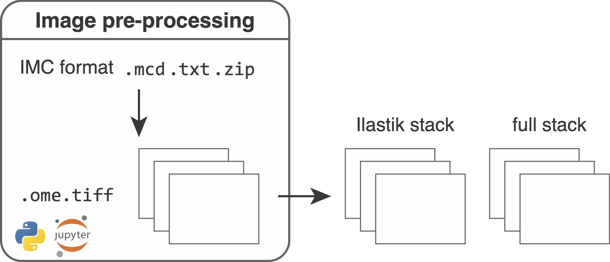

# Pre-processing

<figure markdown>
  { width="500" }
</figure>

During the first step of the segmentation pipeline, raw data need to be converted to file formats that can be read-in by external software (`Fiji`, `R`, `python`, `histoCAT`).

**Please follow the [preprocessing.ipynb](https://github.com/BodenmillerGroup/ImcSegmentationPipeline/blob/main/scripts/imc_preprocessing.ipynb) script to pre-process the raw data.**  
To get started, please refer to the instructions [here](index.md).

## Input

**The zipped .mcd files**

The Hyperion Imaging System produces vendor controlled `.mcd` and `.txt` files in the following folder structure:

```
├── {XYZ}_ROI_001_1.txt
├── {XYZ}_ROI_002_2.txt
├── {XYZ}_ROI_003_3.txt
├── {XYZ}.mcd
```

where `XYZ` defines the filename, `ROI_001`, `ROI_002`, `ROI_003` are names (description) for the selected regions of interest (ROI) and `1, 2, 3` indicate the acquistion identifiers. 
The ROI description entry can be specified in the Fluidigm software when selecting ROIs.
The `.mcd` file contains the raw imaging data of all acquired ROIs while each `.txt` file contains data of a single ROI.
To enforce a consistent naming scheme and to bundle all metadata, **we recommend to zip the folder** and specify the location of all `.zip` files for preprocessing. Each `.zip` file should only contain data from a single `.mcd` file and the name of the `.zip` file should match the name  of the `.mcd` file.

**The panel file**

The panel file (in `.csv` format) specifies the type of antibodies that were used in the experiment and all additional channels (e.g. metals used for counterstaining[^fn1]) that you want to include in downstream processing.
Example entries to the panel file can look like this:

|  Metal Tag | Target          | full | ilastik |
|  :---      | :---            | :--- | :---    | 
|  Dy161     | Ecad            | 1    | 1       |
|  Dy162     | CD45            | 1    | 0       |
|  Er166     | CD3             | 1    | 1       |
|  Ru100     | Counterstain    | 1    | 0       |

Usually there are more columns but the important ones in this case are `Metal Tag`, `full` and `ilastik`.
The `1` in the `full` column specifies channels that should be written out to an image stack that will be later on used to extract features (also refered to as "full stack"). 
Here, please specify all channels as `1` that you want to have included in the analysis.
The `1` in the `ilastik` column indicates channels that will be used for Ilastik pixel classification therefore being used for image segmentation (also refered to as "Ilastik stack").
During the pre-processing steps, you will need to specify the name of the panel column that contains the metal isotopes, the name of the column that contains the `1` or `0` entries for the channels to be analysed and the name of the column that indicates the channels used for Ilastik training as seen above.

**Naming conventions**

When going through the [preprocessing script](https://github.com/BodenmillerGroup/ImcSegmentationPipeline/blob/main/scripts/imc_preprocessing.ipynb), you will notice the specification of the `_full` and `_ilastik` suffix indicating the two image stacks mentioned above.

## Example data

We provide raw IMC example data at [zenodo.org/record/5949116](https://zenodo.org/record/5949116). This dataset contains 4 `.zip` archives each of which holds one `.mcd` and multiple `.txt` files. The data was acquired as part of the **I**ntegrated i**MMU**noprofiling of large adaptive **CAN**cer patient cohorts (IMMUcan) project [immucan.eu](https://immucan.eu) using the [Hyperion imaging system](https://www.fluidigm.com/products-services/instruments/hyperion). Data of 4 patients with different cancer types are provided. To download the raw data together with the panel file, sample metadata and a pre-trained Ilastik classifier, please follow the [download script](https://github.com/BodenmillerGroup/ImcSegmentationPipeline/blob/main/scripts/download_examples.ipynb).

## Conversion fom .mcd to .ome.tiff files

In the first step of the pipeline, raw `.mcd` files are converted into `.ome.tiff` files[^fn2].
This serves the purpose to allow vendor independent downstream analysis and visualization of the images.
For in-depth information of the `.ome.tiff` file format see [here](https://www.openmicroscopy.org/Schemas/Documentation/Generated/OME-2016-06/ome.html). 
Each `.mcd` file can contain multiple acquisitions. This means that multiple multi-channel `.ome.tiff` files per `.mcd` file are produced. 
The `Fluor` and `Name` entries of each channel are set.
Here `Name` contains the actual name of the antibody as defined in the panel file and `Fluor` contains the metal tag of the antibody.
For IMC data, the metal tag is defined as: `(IsotopeShortname)(Mass)`, e.g. Ir191 for Iridium
isotope 191.

To perform this conversion, we use the `extract_mcd_file` function of the internal `imcsegpipe` python package.
It uses the [readimc](https://github.com/BodenmillerGroup/readimc) python package to read `.mcd` files and the [xtiff](https://github.com/BodenmillerGroup/xtiff) python package to write the `.ome.tiff` files.

The `ometiff` output folder for each sample has the following form:

```
├── {XYZ}_s0_a1_ac.ome.tiff
├── {XYZ}_s0_a2_ac.ome.tiff
├── {XYZ}_s0_a3_ac.ome.tiff
├── {XYZ}_s0_a1_ac.ome.csv
├── {XYZ}_s0_a2_ac.ome.csv
├── {XYZ}_s0_a3_ac.ome.csv
├── {XYZ}_s0_p1_pano.png
├── {XYZ}_s0_slide.png
├── {XYZ}_schema.xml
```

Next to the individual `.ome.tiff` files (one per acquisition), `.csv` files are generated that contain the channel name (the metal isotope) and the channel label (the name of the antibody) in the correct channel order.
The `_pano.png` files contain brighfield panorama acquisitions of the sample where the slide overview is stored as `_p1_pano.png`. The `_schema.xml` file contains the internal metadata of the `.mcd` file in `.xml` format.

The `.mcd` to `.ome.tiff` conversion step additionally generates the `analysis/cpinp/acquisition_metadata.csv` file that stores per acquisition metadata for later use in CellProfiler.

## Conversion from .ome.tiff to single-channel tiffs

In the next pre-processing step, `.ome.tiff` files are converted to a format that is supported by the [histoCAT](https://bodenmillergroup.github.io/histoCAT/) software[^fn3].
To load images into `histoCAT`, they need to be stored as unsigned 16-bit or unsigned 32-bit single-channel `.tiff` files. 
For each acquisition (each `.ome.tiff` file), the `export_to_histocat` converter function exports one folder containing all measured channels as single-channel 32-bit `.tiff` files.
The naming convention of these `.tiff` files is `Name_Fluor`, where `Name` is the name of the antibody (or the metal if no name is available) and `Fluor` is the name of the metal isotope.
For full documentation on the `histoCAT` format, please follow [the manual](https://github.com/BodenmillerGroup/histoCAT/releases/download/histoCAT_1.76/histoCATmanual_1.76.pdf).
Part of a single histoCAT folder will look as follows:

```
├── 131Xe_Xe131.tiff
├── Beta-2M-1855((2962))Nd148_Nd148.tiff
├── ...
```

## Conversion from .ome.tiff to multi-channel tiffs

For downstream analysis and Ilastik pixel classification, the `.ome.tiff` files are converted into two multi-channel image stacks in TIFF format:

**1. Full stack:** The full stack contains all channels specified by the "1" entries in the `full` column of the panel file. This stack will be later used to measure cell-specific expression features of the selected channels.

**2. Ilastik stack:** The Ilastik stack contains all channels specified by the "1" entries in the `ilastik` column of the panel file. This stack will be used to perform the ilastik training to generate cell, cytoplasm and background pixel probabilities (see [Ilastik training](ilastik.md)).

Additional image stacks can be generated by adapting the panel file and specifying the suffix of the file name. 

**Hot pixel filtering:** Each pixel intensity is compared against the maximum intensity of the 3x3 neighboring pixels. If the difference is larger than a specified threshold, the pixel intensity is clipped to the maximum intensity in the 3x3 neighborhood. Setting `hpf=None` disables hot pixel filtering in this conversion step.

By default the hot pixel filtered full stack is written out to the `analysis/cpout/images` folder and the hot pixel filtered Ilastik stack is written out to the `analysis/ilastik` folder.

The `analysis/ilastik` folder contains files such as:

```
├── {XYZ}_s0_a1_ac_ilastik.tiff
├── {XYZ}_s0_a1_ac_ilastik.csv
├── ...
```

The `analysis/cpout/images` folder contains following files:

```

├── {XYZ}_s0_a1_ac_full.tiff
├── {XYZ}_s0_a1_ac_full.csv
├── ...
```

The matching `.csv` files contain the channel names (metals) in the correct channel order.


## Export of acquisition-specific metadata

In the final step of the pre-processing pipeline, a `.csv` file containing the full stack channel names (metal isotopes) and a `.csv` file containing the channel names of the images storing pixel probabilities (see [Ilastik training](ilastik.md)) are written out to the `analysis/cpinp/` folder.

## Output

After image pre-processing the following files have been generated:

* `analysis/ometiff`: contains individual folders (one per sample) of which each contains multiple `.ome.tiff` files (one per acquisition).  
* `analysis/histocat`: contains individual folders (one per acquisition) of which each contains multiple single-channel `.tiff` files for upload to histoCAT.  
* `analysis/ilastik`: contains the ilastik stacks for pixel classification as well as `.csv` files indicating the channel order.  
* `analysis/cpout/images`: contains the full stacks for analysis as well as `.csv` files indicating the channel order.  
* `analysis/cpout/panel.csv`: the panel file was copied into the final output folder.  
* `analysis/cpinp`: containing the `acquisition_metadata.csv`, `full_channelmeta.csv`, and `probab_channelmeta_manual.csv` files containing acquisition and channel metadata 

[^fn1]: Catena R. _et al._ (2018) Ruthenium counterstaining for imaging mass cytometry. The Journal of Pathology 244(4), pages 479-484.
[^fn2]: Goldberg I.G. _et al._ (2005) The open microscopy environment (OME) data model and XML file: open tools for informatics and quantitative analysis in biological imaging. Genome Biology 6(5), R47.
[^fn3]: Shapiro D. _et al._ (2017) histoCAT: analysis of cell phenotypes and interactions in multiplex image cytometry data. Nature Methods 14, pages 873–876.