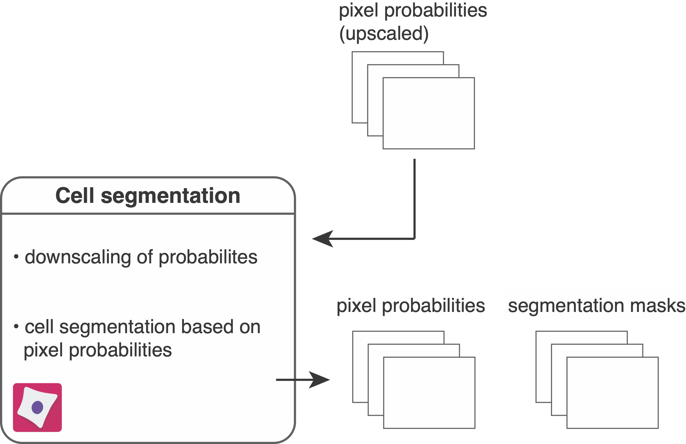

# Cell segmentation

<figure markdown>
  { width="500" }
</figure>

To segment individual objects (here these are cells) in images, the following CellProfiler pipeline reads in pixel probabilities (generated in [Ilastik pixel classification](ilastik.md)) for segmentation.
Set up the pipeline by importing the `resources/pipelines/2_segment_ilastik.cppipe` pipeline into CellProfiler and perform following steps:

1. Drag and drop the `analysis/ilastik` folder into the `Images` window.
2. In the `Output Settings` adjust the `Default Output Folder` to `analysis/cpout`.  

The following steps are part of the pipeline:

1. The files ending with `_Probabilities.tiff` are read in as part of the `NamesAndTypes` module.
2. The images containing pixel probabilities are downscaled by a factor of 0.5 to match the initial image dimensions.
3. In `ColorToGray` the 3 channel probability images are split into their individual channels: channel 1 - nucleus; channel 2 - cytoplasm; channel 3 - background.  
4. The nulcear and cytoplasmic channels are summed up to form a single channel indicating the full cell probability.  
5. The nuclear probabilities are smoothed using a gaussian filter. This step can be adjusted or removed to increase segmentation success. 
6. The `IdentifyPrimaryObjects` module is crucial to correctly identifying nuclei. Use the test mode and enable the "eye" icon next to the module to observe if nuclei are correctly segmented. The advanced settings can be adjusted to improve segmentation.  
7. The `MeasureObjectSizeShape` module measures the size of the nuclei and the `FilterObjects` module filters nuclei below a specified threshold. 
8. The `IdentifySecondaryObjects` module expands from the identified nuclei to the border of the full cell probability generated in step 3 or until touching the neighboring cell. 
9. The segmentation masks are converted to 16-bit images. 
10. The segmentation masks are written out as 16-bit, single-channel `.tiff` images to the `analysis/cpout/masks` folder.
11. The downscaled pixel probability images are written out as 16-bit, 3 channel `.tiff` images to the `analysis/cpout/probabilities` folder.

## Output

After image segmentation the following files have been generated:

* `analysis/cpout/masks`: contains single-channel segmentation masks in 16-bit `.tiff` format. Segmentation masks are single-channel images that match the input images in size, with non-zero grayscale values indicating the IDs of segmented objects.
* `analysis/cpout/probabilities`: contains 3 channel images in 16-bit `.tiff` format representing the downscaled pixel probabilities after Ilastik pixel classification.
